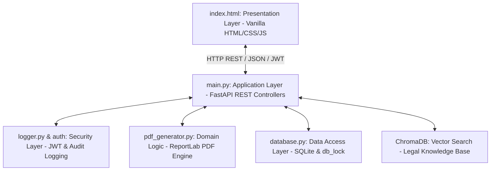

# 🏛️ LexAI — User Manual & Installation Guide
### **BSCS24041 Assignment 2 & Semester Project Submission**
**AI Legal Advisor & Pakistan Tax Filer Platform**
*Designed with Layered Clean Architecture & RAG-Enhanced Groq LLaMA Intelligence*

---

> [!NOTE]
> This document serves as the official **User Manual & System Walkthrough** for the LexAI platform. It details system prerequisites, step-by-step installation, architecture abstractions, and operation of all major modules.

---

## 🏗️ System Architecture & Modularity

LexAI is engineered using a robust **Layered Architectural Style** that enforces a strict separation of concerns between presentation, business rules, and data persistence layers:



| Layer / Component | Technology | Separation of Concerns |
| :--- | :--- | :--- |
| **Presentation Layer** | Vanilla HTML5, CSS3 Variables, ES6 JavaScript | Handles rendering, animations, circular score drawing, and client-side states. Zero-compile, instant-load framework. |
| **Application Layer** | FastAPI / Python 3.10+ | Orchestrates 18+ REST endpoints, rate limiting (`slowapi`), and handles routing context. |
| **Security Layer** | PyJWT, bcrypt, `passlib` | Enforces JWT state verifications, cryptographically hashes user passwords, and logs system events. |
| **Domain Logic** | ReportLab 4.x PDF engine | Renders legal and FBR-compliant PDF contracts and returns. |
| **Data Access Layer** | SQLite3, `threading.Lock()` | Persists accounts, vault files, notifications, and analytics with concurrent access safeguards. |
| **Semantic Search Layer** | ChromaDB, sentence-transformers | Hosts 7,400+ indexed statutory chunks for regional RAG queries. |

---

## 🚀 Installation & Setup Guide

### 1. Prerequisites
Ensure you have the following installed on your machine:
* Python 3.10 or higher
* `pip` (Python package manager)
* A valid internet connection (for downloading model embeddings on first boot and querying the Groq free-tier LLM API)

### 2. Quick-Start (Automatic Script)
Run the automated startup script:
```bash
cd lex
python3 run.py
```
This script will automatically detect your OS, set up a virtual environment (`.venv`), install all requirements, seed the legal database, and start the local server.

### 3. Manual Installation Steps
If you prefer setting up the workspace manually, execute the following commands in your shell:

```bash
# 1. Create a virtual environment
python3 -m venv .venv

# 2. Activate the virtual environment
source .venv/bin/activate

# 3. Install required libraries
pip install -r requirements.txt

# 4. Initialize and seed the RAG vector collection
python3 batch_ingest.py

# 5. Start the FastAPI backend
uvicorn main:app --host 0.0.0.0 --port 8000
```

---

## 🎛️ Feature Walkthrough

### 🔒 1. User Authentication & Security Settings
* **Registration**: Navigate to the application. Click **Create Account** inside the dark-themed authentication panel. Password strength indicators will guide you to formulate a secure password (hashes are computed using industry-standard `bcrypt`).
* **Session Management**: Upon successful sign-in, the system distributes a cryptographically signed JWT. The token is stored locally and securely attached to all subsequent request headers as a `Bearer` token.
* **Notifications**: Live notification dropdown (`🔔`) in the upper-right corner flags critical activities like successful logins, vault uploads, or compliance scans.

### ⚖️ 2. Global Legal Advisor (RAG-Enabled Chat)
* **How it works**: Select a **Jurisdiction** (e.g., Pakistan, UK, US), regional context (e.g., Punjab, Sindh), and a **Topic** (e.g., Tenant Rights). 
* **Semantic Querying**: Ask a specific question (e.g., *"Can my landlord evict me without notice?"*). The vector engine performs a semantic lookup against ChromaDB and feeds relevant statutory clauses directly to Groq LLaMA.
* **Outcome**: The AI generates a detailed formal legal brief, citing **exact laws** (e.g., *Section 14 of the Punjab Rented Premises Act 2009*) with complete structural clarity.
* **Document Generator**: Select **Generate Tenancy Agreement** to automatically generate a formal binding legal contract, downloadable in high-definition PDF or automatically saved directly into your secure vault.

### 📊 3. Withholding Rates & Savings Calculator
* **Rates Chart**: Compares withholding tax percentages between registered Filers and Non-Filers under the FBR 2024–25 tax slabs (cash withdrawals, property purchases, vehicle register, etc.).
* **Savings Calculator**: Enter a transaction amount (e.g., 5,000,000 PKR property purchase) to view direct comparative savings. The system will plot a sleek visual savings comparison bar with real-time tax optimization advice.

### 📄 4. 4-Step Pakistan Tax Compliance Wizard
* **Wizard Walkthrough**:
  1. *Personal Details*: Inputs legal name, CNIC, DOB, mobile, and address.
  2. *Income Details*: Salaried or business type selection with annual figures.
  3. *Asset Declaration*: Logs property holdings, motor vehicles, bank assets, and cash.
  4. *Compilation*: Renders a complete FBR-compliant NTN application, Income Tax Return statement, and Wealth Statement.
* **PDF Downloads**: Uses ReportLab layout templates to package details into formal, official FBR-branded A4 PDF files.

### 🔍 5. Secure Vault & Legal Audit Engine
* **Cloud Vault**: Upload, view, download, or delete legal contracts, tax declarations, and affidavits.
* **Document Verification**: Click **Verify** next to any uploaded contract or file to launch the **AI Compliance Scan**.
* **Visual Progress State**: The interface dynamically strikes a digital gavel while progressing step-by-step:
  * `⚖️` *Initializing Legal Compliance Scan...*
  * `📖` *Reading document syntax & clauses...*
  * `🛡️` *Analyzing risk & enforceability...*
  * `🏆` *Compiling quality score & recommendations...*
* **Compliance Audit Dashboard**: Renders a circular progress wheel marking your document's score out of 100, badges its status (Compliant, Attention Required, Critical), highlights key Strengths, flags Vulnerabilities, suggests Revisions, and writes a detailed clause-by-clause analysis.

---

## 🛠️ Troubleshooting & Support

> [!WARNING]
> **API Key Error**: If chat or verification fails, check that a valid `GROQ_API_KEY` is loaded inside your `.env` file or pasted into the start panel of the web interface.

> [!IMPORTANT]
> **Port Conflicts**: If the server exits with a bind error (`Address already in use`), check if another FastAPI instance is active or specify an alternative port:
> `uvicorn main:app --host 0.0.0.0 --port 8080`
